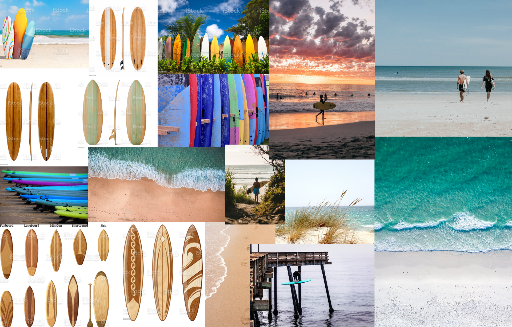

<h1 style="font-size: 20px">CHORUS - <i>Surfboard Retail Company Website</i> - 2022</h1>

<h2 style="font-size: 18px">PROJECT OVERVIEW</h2>

The following project is a website design concept presentation, based from an auto-generated design brief, for a fictional retail company called Chorus. They make customized luxury surfboards and their target audience is kids.

<h2 style="font-size: 18px">THE CHALLENGE</h2>

The inquiry from Chorus was for a design that is approachable enough to attract anyone interested in surfing for the fun of it, while also appealing to those with more competitive goals. They wanted a website built with the aim to first, and foremost, sell the company's products. The inquiry requested a Landing Page with the goal of maximizing conversions, an About Page, Shop Page, and a Privacy Policy page. They requested the Landing Page draw the user's attention to the option of calling the company for more information. They also preferred a minimalist design that incorporates their brand color, blue.

<h2 style="font-size: 18px">BRAND GUIDELINES</h2>

  
  

<h2 style="font-size: 18px">THE PROCESS</h2>

Starting out, I reflected on what the client wanted to establish the above brand guidelines to work off of, observing design structures used in real surfboard retailers' websites, and taking into account user experience (UX) design standards. Next came the process of creating the clickable, high-fidelity wireframe prototype (version 1) in Adobe XD. The prototype contains "Lorem Ipsums" taking the place of an actual body of content a real client would have written. Images were sourced from resources such as Unsplash, Pexels, Shutterstock, etc.

Once I made my v. 1 prototype, I uploaded it to a website creators use for finding real volunteers to test their interface designs to gain insights on moving forward with re-designing an improved, finalized project. I commissioned a minimum of 20 testers, male and female, between the ages of 18 to 65, to test the mission of moving from the starting point at the Landing Page, to the ending point at the Order Surfboard Page. Testers provided feedback regarding the difficulty level of the mission to purchase a custom-made surfboard, and gave their opinions on the visual design/layout of the interface's mission critical pages, as well as supplemental pages like the About Us and Privacy Policy pages. Due to the technical limitations of the testing website, users were not able to view non-static elements such as animations/transitions.

From these results, I found that almost all of the testers had a positive impression. When asked on the prototype's strengths, testers mostly commented on its ease of use, cleanness of design, usage of images, and logical flow of information. Testers did not offer much in the way of commenting on the prototype's weaknesses, but what I've gathered from those responses, the prototype could stand to be more dynamic and modernized aesthetically.

Commonly written suggestions given by testers included:

<ul>
  <li>Incorporating more color variety</li>
  <li>Implementing main background color that isn't white</li>
  <li>Moving placement of, and re-sizing, certain buttons & boxes</li>
  <li>Improving alignment and increasing spacing between headers</li>
  <li>Making Logo and Call to Action on Landing Page more prominent</li>
  <li>Cutting down on amount of text, particularly on Employee Profile Page</li>
</ul>

Keeping this feedback in mind, I re-visited my prototype to create an updated version with a renewed perspective.

<h2 style="font-size: 18px">FINALIZED DESIGN</h2>

The following are static .PNG screenshots highlighting the prototype, which is an XD file. XD files are not able to be embedded into GitHub repositories at this time. If you wish to view more high-definition screenshots, please see the accompanying PDFs in this repository. 

<h3 style="font-size: 16px" align="center">LANDING PAGE</h3>

<h3 style="font-size: 16px" align="center">ABOUT PAGE</h3>

<h3 style="font-size: 16px" align="center">PRIVACY POLICY PAGE</h3>

<h3 style="font-size: 16px" align="center">SHOPPING USER FLOW</h3>

 

The following page's layout is intended to represent a form. The user fills this out, which generates their customized design of a surfboard they are intending to actually order as a fully-realized, tangible product built by the company. 

 

 

After the user selects their four customizations: Shape, Logo, Primary Color, and Secondary Color, the final step the user takes in this module is selecting "GENERATE PREVIEW". When this is selected, a real-time mockup appears to show the user how their surfboard is expected to look in reality. If the user wishes to re-do their design, selecting "RESTART YOUR ORDER" will bring the user back to the top of the Surfboard Builder module. If the user is satisfied with their design, selecting "COMPLETE YOUR ORDER" will take the user to the Order Completion Page. ⬇️ 

 

 

Selecting "GO BACK" brings the user back to the previous page. Selecting "SUBMIT ORDER" at the bottom of the form takes the user to the Order Confirmation Page. ⬇️

 

